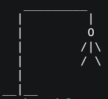

# SAE_Socket - Version 0 stable
<header>
    <p style= "margin-bottom: 0px">Membres :</p>
    <ul style="
    list-style: none;
    margin-top: 0px;
    ">
        <strong>&gt; LAURENCE</strong> Maxence TD1 - TPB<br>
        <strong>&gt; CÉSAIRE</strong> Lilian TD1 - TPB<br>
        <strong>&gt; KHELIFI</strong> Neda TD2 - TPC<br>
        <strong>&gt; LEVITRE</strong> Mathys TD1 - TPB<br>
    </ul>
    
    
</header>

> ## 1. Utilisation
**> Compilation du serveur**
```bash
gcc serveur_base_tcp.c game_pendu.c -o serveur
```

**> Compilation du client**
```bash
gcc client_base_tcp.c pendu_ascii.c -o client
```

> ## Règles du jeu 

